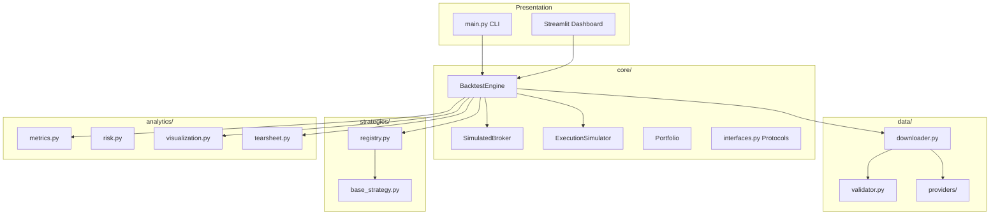
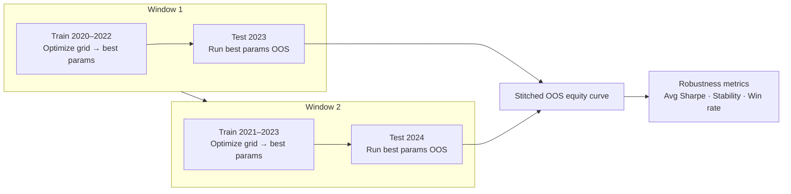
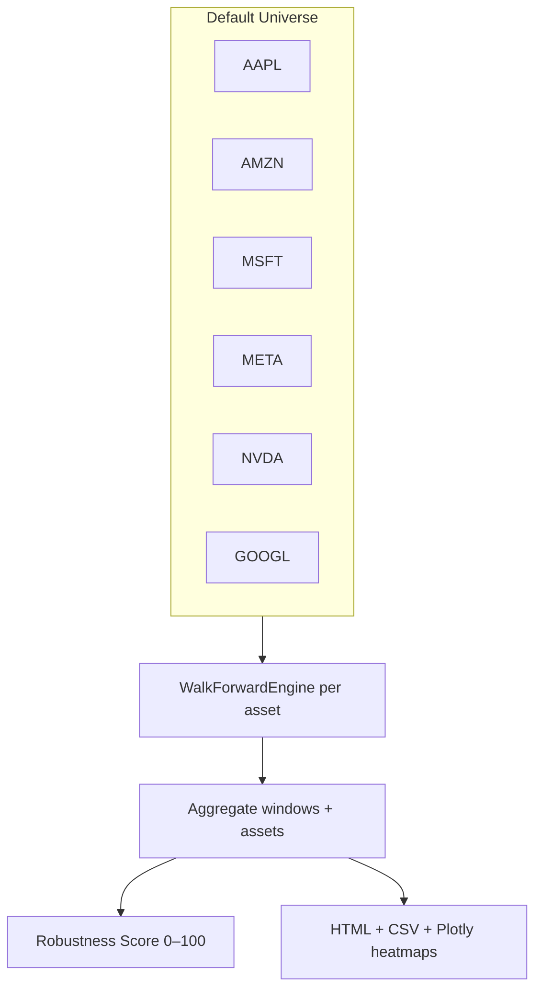

# Nexiuma

**Nexiuma** is a production-oriented quantitative research and systematic trading platform. It provides institutional-quality architecture for strategy research, historical backtesting, portfolio analytics, risk management, and performance reporting.

> **Disclaimer:** For research and education only. Not investment advice.

---

## Features

- **Market Data** — yfinance OHLCV with parquet cache, validation, retry, and auto-refresh
- **Strategy Engine** — Abstract signal API (`generate_signal`, `position_size`, `risk_parameters`)
- **Core Layer** — Protocol-driven broker, portfolio, execution, and engine abstractions
- **Backtesting** — backtrader with commission, slippage, stop-loss, take-profit, vol sizing
- **Analytics** — CAGR, Sharpe, Sortino, Calmar, VaR, CVaR, benchmark comparison
- **Visualization** — Equity, drawdown, price/trades, rolling returns, return distribution
- **Reporting** — Jinja2 HTML reports and tearsheets
- **Walk-Forward Testing** — Rolling train/test optimization with out-of-sample validation
- **Walk-Forward Universe** — Cross-asset robustness scoring and research reports
- **Dashboard** — Modern Streamlit UI

---

## Requirements

- Python **3.12+** (3.9+ supported for development)
- Dependencies in [`requirements.txt`](requirements.txt)

---

## Installation

```bash
cd Nexiuma
python3.12 -m venv .venv
source .venv/bin/activate
pip install -r requirements.txt
cp .env.example .env
```

---

## Quick Start

```bash
# List strategies
python main.py strategies

# Download data
python main.py download --ticker AAPL --start 2020-01-01 --end 2024-12-31

# Run backtest + report
python main.py backtest --ticker AAPL --strategy moving_average

# Backtest with custom MA periods
python main.py backtest --ticker AAPL --strategy moving_average --fast-period 20 --slow-period 50

# Optimize moving-average periods
python main.py optimize --ticker AAPL --strategy moving_average

# Optimize parameters across the default universe
python main.py optimize-universe --strategy moving_average

# Compare all strategies on one ticker
python main.py compare --ticker AAPL

# Run one strategy across the default universe
python main.py compare-universe --strategy moving_average

# Walk-forward: optimize on train, validate on unseen test windows
python main.py walkforward --ticker AAPL --strategy moving_average

python main.py walkforward \
  --ticker NVDA \
  --strategy moving_average \
  --train-years 3 \
  --test-years 1

# Walk-forward across the default universe (robustness report)
python main.py walkforward-universe --strategy moving_average

python main.py walkforward-universe \
  --strategy moving_average \
  --tickers AAPL,MSFT,NVDA \
  --train-years 3 \
  --test-years 1

# Dashboard
streamlit run dashboard/streamlit_app.py
```

---

## Architecture



### Data Flow

1. **Config** loads `.env` + CLI overrides → `NexiumaSettings`
2. **Downloader** fetches/caches OHLCV → **Validator** cleans and validates
3. **Engine** builds backtrader cerebro with **Broker** + **ExecutionSimulator**
4. **Strategy** emits `Signal` each bar → orders sized via `position_size()`
5. **EquityCurveAnalyzer** records portfolio value
6. **PerformanceAnalyzer** computes metrics + benchmark alpha
7. **ChartGenerator** + **ReportGenerator** persist artifacts

### Walk-Forward Testing

Walk-forward analysis prevents **in-sample overfitting** by never testing on data used for parameter selection.



**Why walk-forward beats simple optimization:** Optimizing on the full 2020–2024 dataset selects parameters that fit *all* history—including future bars the optimizer shouldn't see. Walk-forward mimics live deployment: parameters are chosen on past data only, then evaluated on genuinely unseen periods. Degradation from train to test Sharpe is a direct measure of overfit risk.

| Phase | Action |
|-------|--------|
| **Train** | Grid-search MA periods on training window; select best by Sharpe |
| **Test** | Run selected params on next out-of-sample window |
| **Roll** | Advance both windows; repeat until data exhausted |
| **Aggregate** | Stitch OOS equity, compute robustness metrics, generate report |

**Outputs** (`reports/walkforward/{TICKER}_{strategy}_{timestamp}/`):

| File | Description |
|------|-------------|
| `walkforward_results.csv` | Per-window train/test metrics |
| `parameter_history.csv` | Selected params per window |
| `equity_curve.png` | Stitched out-of-sample equity |
| `performance_chart.png` | Train vs test Sharpe/return bars |
| `interactive_charts.html` | Plotly parameter history & comparisons |
| `summary.html` | Professional HTML report with conclusions |

<!-- Screenshot placeholder: walk-forward summary report -->
<!-- Screenshot placeholder: walk-forward equity curve -->

### Walk-Forward Universe Analysis

Extends single-asset walk-forward to an entire basket, producing a **cross-asset robustness report** with a composite 0–100 score.



**Workflow:**
1. For each asset, run full walk-forward (optimize train → test OOS)
2. Flatten all asset-window results into universe tables
3. Compute aggregate metrics, parameter frequency, best/worst assets
4. Calculate robustness score and generate research report

**Robustness Score (0–100):**

| Range | Grade | Interpretation |
|-------|-------|----------------|
| 90–100 | Exceptional | Strong OOS performance, low degradation |
| 70–89 | Strong | Acceptable cross-asset robustness |
| 50–69 | Moderate | Mixed results, parameter instability |
| 30–49 | Weak | Significant overfitting signals |
| 0–29 | Poor | Unreliable out-of-sample performance |

Components: Test Sharpe (30 pts) · Low degradation (25 pts) · Win rate (25 pts) · Parameter stability (20 pts)

**Outputs** (`reports/walkforward_universe/{strategy}_{timestamp}/`):

| File | Description |
|------|-------------|
| `asset_results.csv` | Per-asset aggregated walk-forward metrics |
| `summary.csv` | Universe-level statistics |
| `parameter_frequency.csv` | How often each param set was selected |
| `window_results.csv` | Every asset × window detail row |
| `sharpe_heatmap.html` | OOS Sharpe heatmap (asset × window) |
| `degradation_heatmap.html` | Train−test Sharpe degradation heatmap |
| `robustness_chart.html` | Interactive Plotly dashboard |
| `index.html` | Full HTML research report |

<!-- Screenshot placeholder: walk-forward universe robustness dashboard -->
<!-- Screenshot placeholder: walk-forward universe heatmap -->

---

## Folder Structure

| Folder | Purpose |
|--------|---------|
| `config/` | Centralized dataclass settings (.env + CLI) |
| `core/` | Engine, broker, portfolio, execution, Protocol interfaces |
| `data/` | Download, validate, cache, provider adapters |
| `strategies/` | Signal logic + backtrader bridge |
| `analytics/` | Metrics, risk, tearsheet, charts |
| `research/` | Comparison, optimization, walk-forward engines |
| `backtests/` | Runner alias + custom analyzers |
| `reports/` | HTML generator + Jinja2 templates |
| `dashboard/` | Streamlit application |
| `tests/` | pytest unit & integration tests |
| `notebooks/` | Research notebooks |
| `logs/` | Rotating loguru file logs |

---

## Configuration

| Variable | Description |
|----------|-------------|
| `TICKER` | Symbol (e.g. `AAPL`) |
| `STRATEGY` | `moving_average`, `rsi`, `momentum` |
| `INITIAL_CAPITAL` | Starting cash |
| `STOP_LOSS_PCT` / `TAKE_PROFIT_PCT` | Risk exits |
| `COMMISSION_PCT` / `SLIPPAGE_PCT` | Transaction costs |
| `USE_VOLATILITY_SIZING` | Vol-target position sizing |

---

## Adding a Strategy

1. Create `strategies/my_strategy.py`:

```python
from core.interfaces import Signal, SignalAction
from strategies.base_strategy import NexiumaStrategy
import backtrader as bt

class MyStrategy(NexiumaStrategy):
    strategy_name = "my_strategy"
    strategy_description = "Custom logic"

    def __init__(self):
        super().__init__()
        self.sma = bt.indicators.SMA(self.data.close, period=10)

    def generate_signal(self) -> Signal:
        if self.sma[0] > self.data.close[0]:
            return Signal(SignalAction.BUY)
        if self.position:
            return Signal(SignalAction.EXIT)
        return Signal(SignalAction.HOLD)
```

2. Register in `strategies/registry.py`
3. Run: `python main.py backtest --strategy my_strategy`

---

## Deploying Streamlit

```bash
streamlit run dashboard/streamlit_app.py --server.port 8501
```

**Docker:**

```dockerfile
FROM python:3.12-slim
WORKDIR /app
COPY requirements.txt .
RUN pip install -r requirements.txt
COPY . .
EXPOSE 8501
CMD ["streamlit", "run", "dashboard/streamlit_app.py", "--server.address=0.0.0.0"]
```

---

## Testing

```bash
pytest
pytest tests/test_strategy_signals.py -v
```

---

## Roadmap

### v2 — Paper Trading & Multi-Asset
- Alpaca paper trading (`core/broker` live adapter)
- Multi-ticker portfolio backtests
- Walk-forward optimization
- TimescaleDB tick storage

### v3 — ML & Institutional
- Feature store + ML signal models
- Interactive Brokers integration
- Factor models & portfolio optimization
- News sentiment pipeline
- Crypto & multi-asset support

---

## License

MIT
